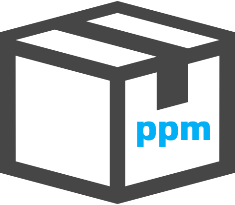

# ppm
<br>


<br><br>
pl Package Manager

## Install packages
```sh
ppm install [package name] 
```

## Remove packages 
```sh
ppm remove [package name]
```

## Update packages
```sh
ppm update [package name]
```

## Search packages
```sh
ppm search [package name]
```

## Get the all local packages
```sh
ppm local-list
```

## Get the all remote package
```sh
ppm remote-list
```